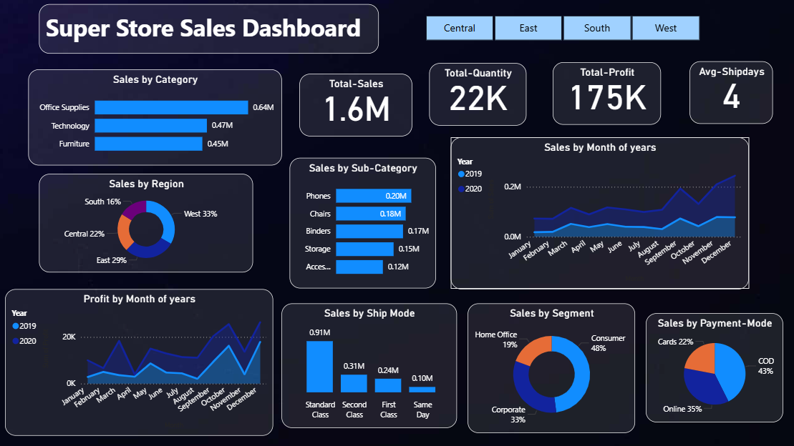

# SuperStore Sales Dashboard | Power BI

This Power BI project analyzes two years of sales data from a fictional SuperStore business (2019–2020). The dashboard provides insights into product performance, regional sales trends, shipping preferences, and customer segmentation — all to support business decision-making and strategy.

---

## Overview

This dashboard answers critical business questions such as:

- Which product categories are generating the most revenue?
- What are the peak sales periods during the year?
- Which regions and customer segments contribute the most to sales?
- What is the preferred shipping mode among customers?

---

## Files Included

| File                                | Description                         |
|-------------------------------------|-------------------------------------|
| `SuperStore Sale Dasboardd.pbix`    | Power BI dashboard project file     |
| `SuperStore Sale Dasboard.pdf`      | Exported static report (PDF format) |

---

## Key Insights (Based on Actual Dashboard)

###  Category & Product Trends
- Office Supplies had the highest sales (around $640K), followed by Technology and Furniture.
- Among sub-categories, Phones and Chairs performed the best.
- Some items like Storage and Accessories had lower sales, which might mean they’re not as popular or need better promotion.

 Maybe run offers on low-selling items or promote them more to boost their sales.

---

### Regional Performance
- Most sales came from the West and East regions. West alone contributed 33%.
- The South region had the least sales (only 16%), so there’s a chance to improve performance there.

A good idea could be to target South with region-specific ads or discounts.

---

### Customer Segments
- Consumers made up 48% of total sales, which is the largest share.
- Corporate and Home Office users also contributed well.
- But consumer customers may buy in small quantities — corporate clients could bring bigger, repeated orders.

It might help to create special deals or bulk discounts for corporate clients.

---

### Shipping Insights
- Standard Class was the most used shipping method (over $910K in sales).
- Same Day delivery was the least used, maybe because it’s more expensive or not widely available.

It seems most customers are okay with waiting if it means cheaper shipping.

---

### Time-Based Trends
- Sales were the highest in November and December — probably due to holiday shopping.
- Profit also increased during these months, which is a good sign.

Businesses can plan more stock and promotions during year-end to take advantage of this trend.

---

### Payment Modes
- Most people used Online (43%) and Cards (35%) for payment.
- Only 22% used Cash on Delivery, which means most customers trust online payments now.

Encouraging digital payments can also reduce return/cancellation risks.

---

### Extra Insight
- Total sales are $1.6M but profit is only $175K — that’s around 11% margin.
- This could mean there are high costs somewhere (like shipping, discounts, or product cost).

Checking which products have low profit margins can help make better pricing decisions.

---

## Dashboard Features

- KPI cards for Total Sales, Profit, Quantity, and Avg. Shipping Days
- Bar and column charts for regional and category analysis
- Line graphs for monthly sales and profit trends
- Pie charts for segment and payment breakdown
- Time-series forecasting using built-in analytics

---

## Tools & Techniques

- Power BI Desktop
- DAX for calculated metrics and KPIs
- Time intelligence functions
- Forecasting visual using line charts

---

## Dashboard Preview

The dashboard gives an overview of total sales, profit, segment performance, shipping trends, and forecast — all in one place.

---
